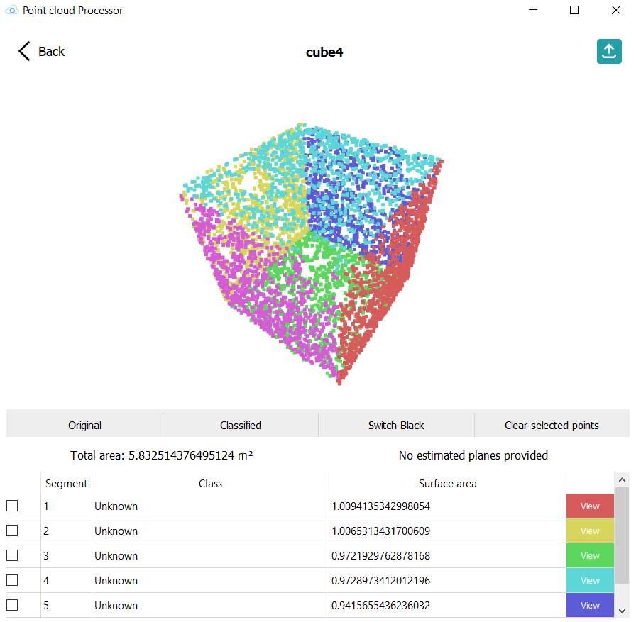

# Drone project
## Information
This repository contains our project for the Afstudeerproject in UCLL.

Our project was about detecting planes inside a point cloud, in order to get information about all the planes in a point cloud.

### Contributors
- Bryan Van Winnendael
- Charles Thuysbaert
- Robbe Van de Velde
- Senne Wittens

## Usage
To run the project you first need to install the required dependencies.
```bash
pip install -r requirements.txt
```

After the dependencies have been installed you can run the project by running the following command:
```bash
python3 main.py
```
This will take you to the main menu, here you can upload your .ply point cloud and select the algorithm you want to use. Multiple other settings are also available.
Choose your settings before you upload the file because the file will be processed immediately after it has been uploaded.


The program will then process the point cloud and show you the results.



When you get the result, you can view each of the planes by pressing the view button. You can also merge planes together for a better end result.

Because our model uses RANSAC to detect planes, it will of course be 100% accurate. This is why the merge function exist. For each segment you can also indicate a class, this could be useful for labeling data.

## Working
This program is seperated into 2 parts:
- The front-end
- The model

### Front-end
This was written in Python using the PyQt5 library. It is simply meant to be a user interface for the model.

### Model
This is the part of the application that will actually process the point cloud.

#### Process
1. Load the point cloud
2. Use RANSAC to detect planes
3. Possibly cluster using a cluster strategy like DBSCAN or agglomerative clustering, using no clustering is also possible
4. Save each of the planes as a .ply file
5. Generate a color range for each plane and save the entire point cloud with the colors
6. Calculate the surface area of each plane
7. Write the info for each plane to a .csv file

#### Extra information
The model is made to be extendable, you can easily add new cluster strategies. All the parameters needed for RANSAC and clustering are stored in a dictionary, this makes it easy to add new parameters.

The model mostly uses Open3D for the processing because it already has functions for RANSAC and DBSCAN.

#### Extra functionalities
The model also contains some extra functionalities that are not used in the front-end, but could be useful for other projects.

- A cleanup function: this will clean all the files that are generated by the model. Usage: 
```bash
python model/clean.py (hard)
```
The hard parameter will also delete the results folder.
- A viewing function that can be used to view a point cloud or a mesh. Usage: 
```bash
python model/view_data.py point-cloud/mesh (file)
```
The first parameter is the type of file you want to view and the file parameter is the path to the file you want to view.
- A function to transform a mesh into a point cloud. Usage: 
```bash
python model/mesh_to_point_cloud.py (file)
```
The file parameter is the path to the mesh you want to transform. This will transform a mesh into a point cloud using the sample Poisson Disk algorithm and results in 16.384 points.
