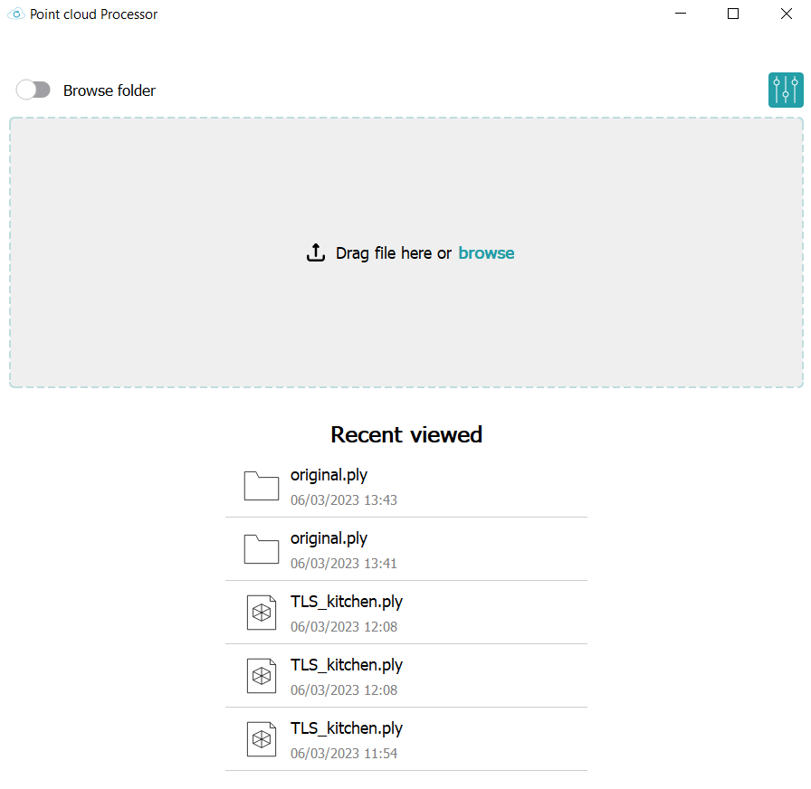
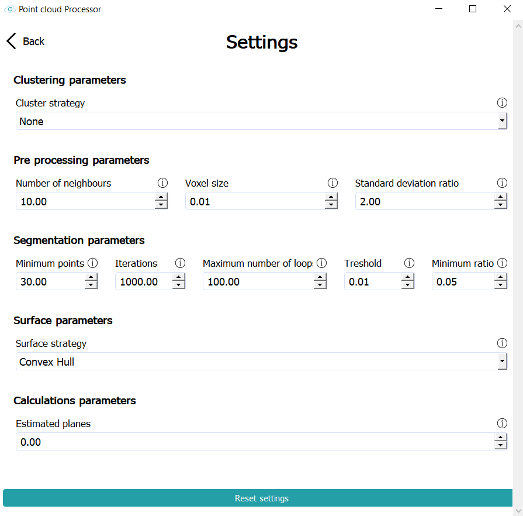

# Drone project
## Information
This repository contains our project for the Afstudeerproject in UCLL.

Our project was about detecting planes inside a point cloud, in order to get information about all the planes in a point cloud.

### Tested versions
The project has been tested on Windows with Python version [3.9.1](https://www.python.org/downloads/release/python-391/) and [3.10.10](https://www.python.org/downloads/release/python-31010/).

This project will not work on Linux or Mac. The model functionalities should work on Linux and Mac.

### Contributors
- Bryan Van Winnendael
- Charles Thuysbaert
- Robbe Van de Velde
- Senne Wittens

## Usage
To run the project you first need to install the required dependencies.
```bash
pip install -r requirements.txt
```

After the dependencies have been installed you can run the project by running the following command:
```bash
python3 main.py
```
Once the program is running, you will be greeted with the home screen. Here you have multiple options for loading in a point cloud:
- Load a point cloud from a .ply file
- Load in a zip file from a previous exported result.
- Load in a folder from a previous exported result. You can use this option by using the switch on the homescreen.
- Select a recent file or folder that you used. 



If you click on the settings icon on the top right, you will be taken to the settings screen. Here you can change the parameters for the segmentation, pre-processing and the clustering.

Each of the parameters has an extra information button that you can click so you know what everything does.



Once you uploaded a file or loaded a folder the program will automatically process the point cloud and take you to the result screen.


### Functionalities

Once the processes point cloud is shown you can do the following:
- View the point cloud and segmented point cloud
- View the different segments that were detected
- View the surface area of each segment
- View the total surface area of all the segments
- View the estimated correctness of the segmentation. This requires that you gave the number of planes that are meant to be detected in the settings. Otherwise there is no way to calculate a correctness percentage.
- Merge different segments together
- Merge points of a specific segment with another segment. This is done by selecting a segment, holding shift and left click and selecting the points you want to merge. Then you select the checkbox of the segment you want to merge the points with and click the merge button.
- Delete a segment
- Delete points from a segment. This is done by selecting a segment, holding shift and left click and selecting the points you want to delete and then clicking the delete button.
- Assign a class to a segment, this is done by click the class on the table and typing the class you want.
- Export the result to a zip file. This zip file will contain:
  - The original point cloud
  - The segmented point cloud
  - All the seperate segments
  - A csv with the surface area and class of each segment
- Change the 3D-viewer background to black or white

## Working
This program is seperated into 2 parts:
- The front-end
- The model

### Front-end
This was written in Python using the PyQt5 library. It is simply meant to be a user interface for the model.

### Model
This is the part of the application that will actually process the point cloud.

#### Process
1. Load the point cloud
2. Use RANSAC to detect planes
3. Possibly cluster using a cluster strategy like DBSCAN or agglomerative clustering, using no clustering is also possible
4. Save each of the planes as a .ply file
5. Generate a color range for each plane and save the entire point cloud with the colors
6. Calculate the surface area of each plane
7. Write the info for each plane to a .csv file

#### Extra information
The model is made to be extendable, you can easily add new cluster strategies. All the parameters needed for RANSAC and clustering are stored in a dictionary, this makes it easy to add new parameters. This dictionary is given throughout the entire segmentation process, so should you want to add new parameters you only need to do it in one place.

Adding new cluster strategies is also simple, in the file model/segmentationProcess/planeDetection.py there is a function called segmentPlanes. This function receives the cluster strategy name as a string and the parameters dictionary. In this function there is a condintional block where you can simply add a new check for your new cluster strategy. This condition block is just meant to return the labels so the rest of the code can proceed.

The model mostly uses Open3D for the processing because it already has functions for RANSAC and DBSCAN. Agglomerative clustering uses the Sci-kit learn implementation.

#### Extra functionalities
The model also contains some extra functionalities that are not used in the front-end, but could be useful for other projects.

- A cleanup function: this will clean all the files that are generated by the model. Usage: 
```bash
python model/clean.py (hard)
```
The hard parameter will also delete the results folder.
- A viewing function that can be used to view a point cloud or a mesh. Usage: 
```bash
python model/viewData.py point-cloud/mesh (file)
```
The first parameter is the type of file you want to view and the file parameter is the path to the file you want to view.
- A function to transform a mesh into a point cloud. Usage: 
```bash
python model/meshToPointCloud.py (file)
```
The file parameter is the path to the mesh you want to transform. This will transform a mesh into a point cloud using the sample Poisson Disk algorithm and results in 16.384 points.

## Known bugs

There is a bug with open3D. If you load in a large point cloud, it is possible that when viewing certain smaller segments, the 3D viewer window will not show the segment. The reason for this is unknown, because you can still view the segments when you view them seperatly using open3D, for example with the model/viewData.py script.

This is probably an issue with open3D itself and not our code, because with smaller point clouds it works fine.
